# Smart CLI Architecture Documentation

## System Overview

Smart CLI is an enterprise-grade AI-powered development assistant built with a modular, extensible architecture. The system combines intelligent request classification, multi-agent orchestration, and specialized operational modes to provide a comprehensive development environment.

## 🏗️ Core Architecture

### High-Level Architecture

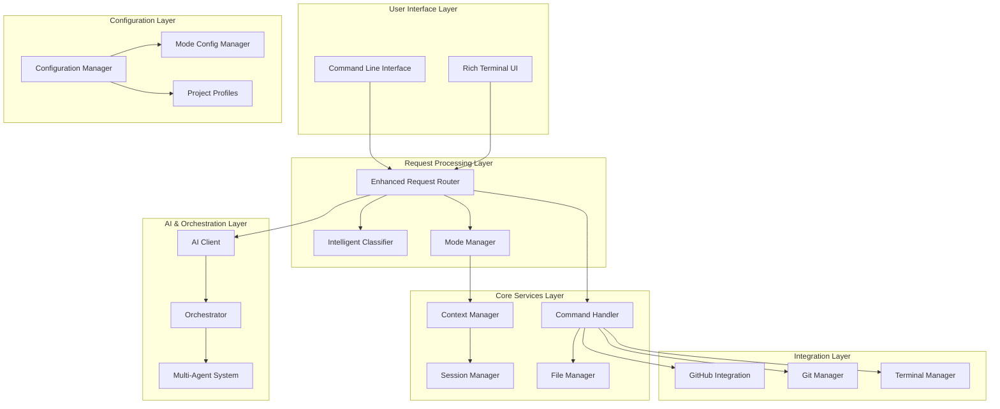

## 📦 Module Structure

### Core Modules

```
src/
├── core/                           # Core system components
│   ├── __init__.py                 # Package exports
│   ├── session_manager.py          # Session lifecycle management
│   ├── file_manager.py             # File system operations
│   ├── command_handler.py          # Command processing
│   ├── request_router.py           # Original request routing
│   ├── enhanced_request_router.py  # Enhanced mode-aware routing
│   ├── intelligent_request_classifier.py  # AI request classification
│   ├── mode_manager.py             # Mode system management
│   ├── context_manager.py          # Context isolation & sharing
│   ├── mode_config_manager.py      # Mode configuration system
│   ├── mode_integration_manager.py # System integration
│   └── mode_system_activator.py    # Mode system activation
├── agents/                         # AI agent implementations
│   ├── orchestrator.py             # Multi-agent orchestration
│   ├── architect_agent.py          # System architecture agent
│   └── meta_learning_agent.py      # Learning and adaptation
├── handlers/                       # Specialized request handlers
│   ├── base_handler.py             # Handler base class
│   ├── cost_handler.py             # Cost management
│   ├── file_handler.py             # File operations
│   ├── git_handler.py              # Git operations
│   ├── github_handler.py           # GitHub integration
│   ├── implementation_handler.py   # Code implementation
│   ├── project_handler.py          # Project management
│   └── terminal_handler.py         # Terminal operations
├── integrations/                   # External service integrations
│   ├── github_client.py            # GitHub API client
│   └── github_manager.py           # GitHub management
└── utils/                          # Utility modules
    ├── config.py                   # Configuration management
    ├── simple_ai_client.py         # AI service client
    └── error_handler.py            # Error handling
```

## 🎭 Enhanced Mode System Architecture

### Mode System Components

The Enhanced Mode System introduces a sophisticated operational model:

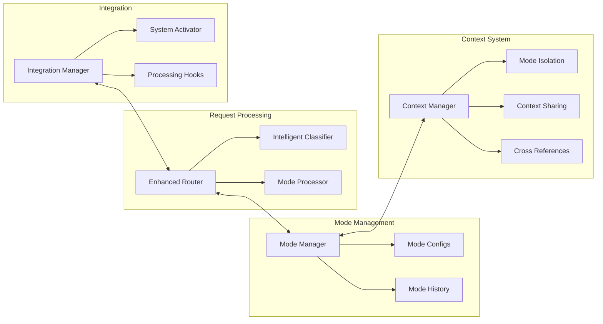

### Mode Lifecycle

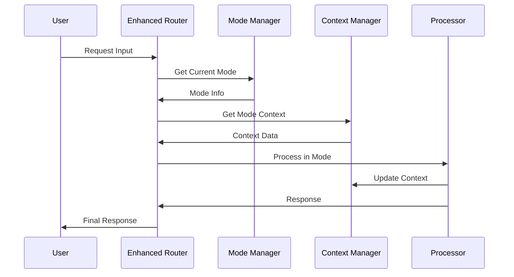

## 🧠 Intelligent Classification System

### Request Classification Flow

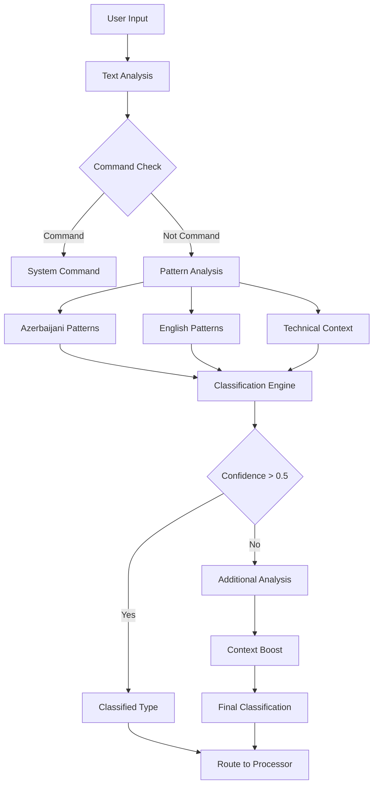

### Classification Categories

1. **COMMAND**: System commands (`/mode`, `/help`, etc.)
2. **DEVELOPMENT**: Code creation, modification, building
3. **UTILITY**: File operations, Git commands, terminal tasks
4. **CONVERSATION**: General AI chat, questions
5. **LEARNING**: Educational content, explanations
6. **ANALYSIS**: Code review, debugging, investigation

## 🤖 Multi-Agent Orchestration

### Orchestrator Architecture

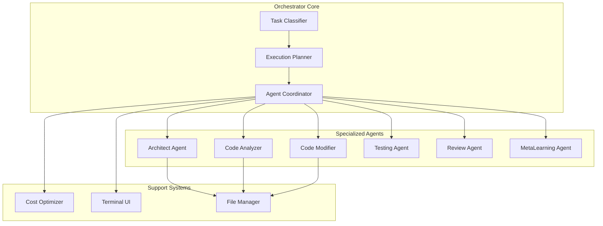

### Agent Collaboration Model

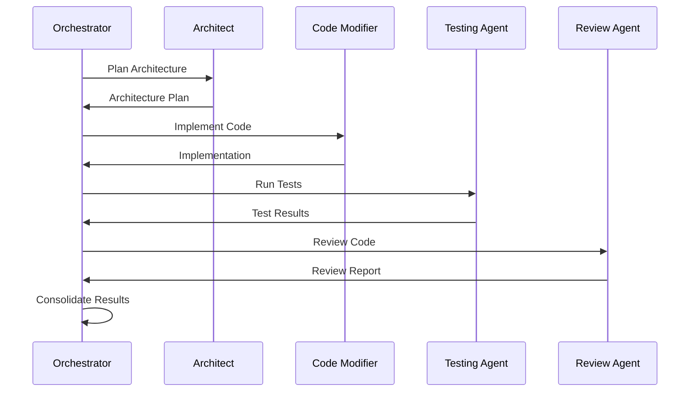

## 🔧 Configuration Architecture

### Configuration Hierarchy

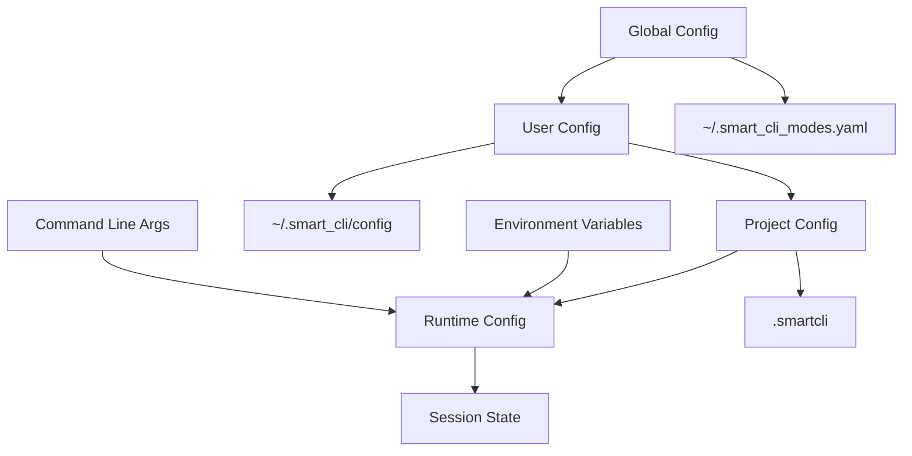

### Configuration Sources

1. **Global Configuration**: `~/.smart_cli_modes.yaml`
   - System-wide defaults
   - Global mode preferences
   - User-specific settings

2. **Project Configuration**: `.smartcli`
   - Project-specific mode settings
   - Team collaboration settings
   - Integration configurations

3. **Runtime Configuration**
   - Session-specific overrides
   - Temporary settings
   - Dynamic adjustments

## 🔄 Request Processing Flow

### Enhanced Request Processing

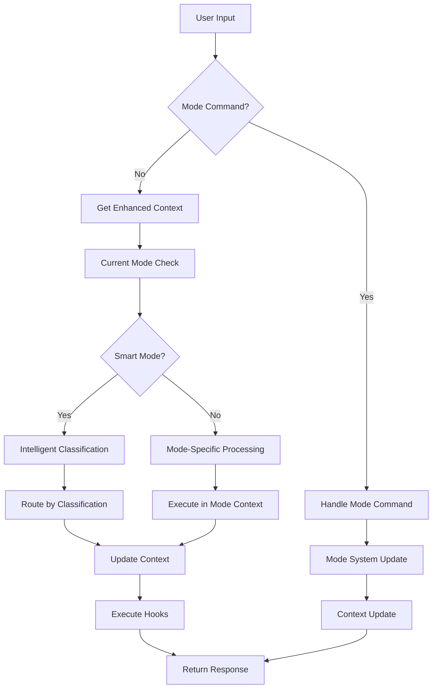

### Context Management Flow

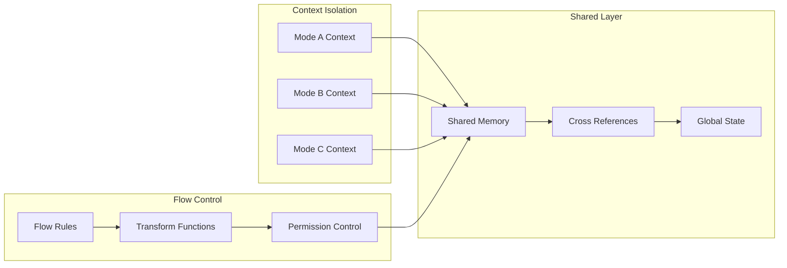

## 📊 Performance Architecture

### Performance Monitoring

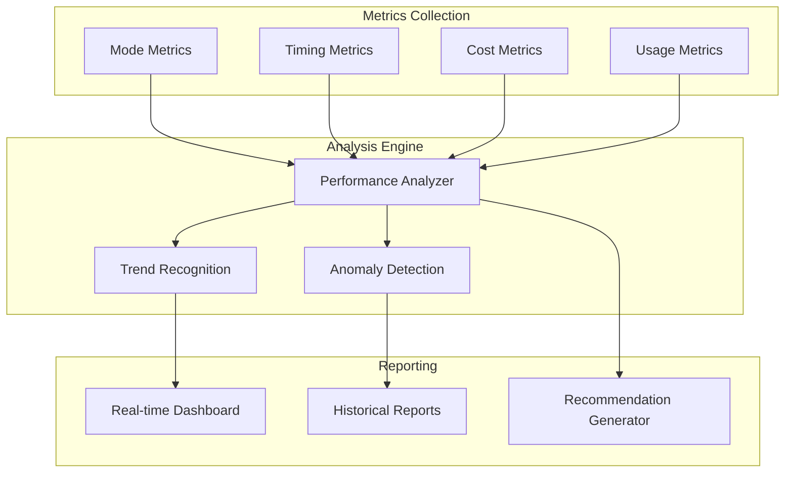

### Cost Optimization

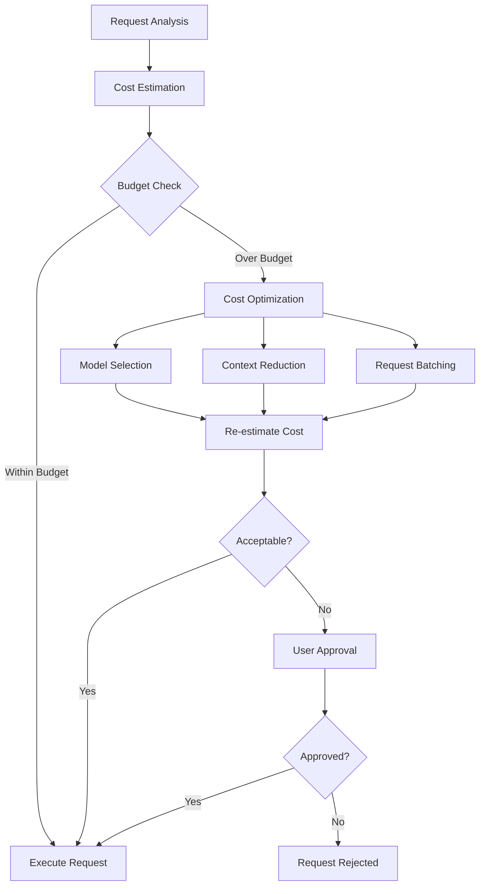

## 🔒 Security Architecture

### Security Layers

```mermaid
graph TB
    subgraph "Input Security"
        IS[Input Sanitization]
        IV[Input Validation]
        IC[Injection Prevention]
    end
    
    subgraph "Access Control"
        AM[Authentication Manager]
        PM[Permission Manager]
        RM[Role Manager]
    end
    
    subgraph "Operation Security"
        OS[Operation Sandboxing]
        FL[File Access Control]
        NL[Network Limitations]
    end
    
    subgraph "Data Security"
        DE[Data Encryption]
        AL[Audit Logging]
        SI[Sensitive Info Detection]
    end
    
    IS --> IV
    IV --> IC
    
    AM --> PM
    PM --> RM
    
    OS --> FL
    FL --> NL
    
    DE --> AL
    AL --> SI
```

### Mode-Based Security

- **Analysis Mode**: Read-only access, no file modifications
- **Learning Mode**: Restricted tool access, safe exploration
- **Code Mode**: Full access with confirmation requirements
- **Fast Mode**: Auto-approval for safe operations only

## 🔌 Integration Architecture

### External Integrations

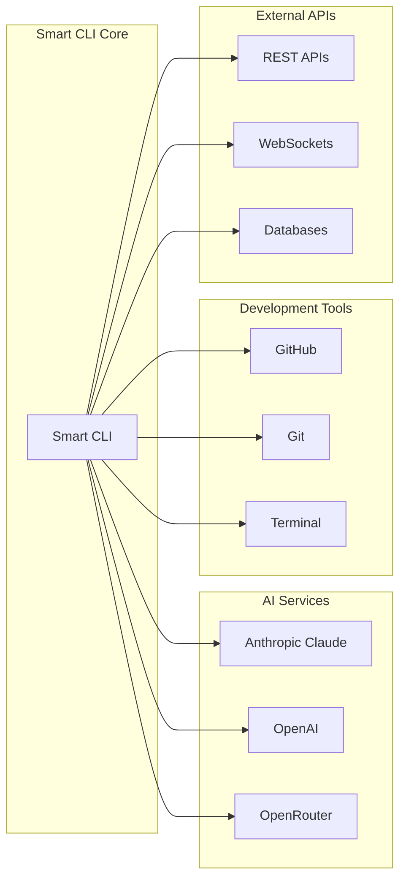

### Integration Manager

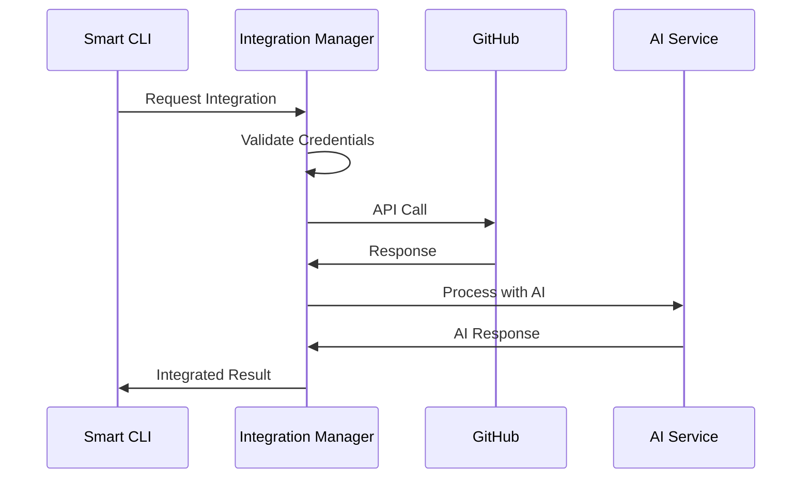

## 🚀 Deployment Architecture

### Development Environment

```yaml
development:
  mode_system: enabled
  debug_logging: true
  cost_limits: relaxed
  ai_providers: 
    - anthropic
    - openai
  integrations:
    - github
    - terminal
    - git
```

### Production Environment

```yaml
production:
  mode_system: enabled
  debug_logging: false
  cost_limits: strict
  security: enhanced
  audit_logging: enabled
  performance_monitoring: enabled
```

### Enterprise Deployment

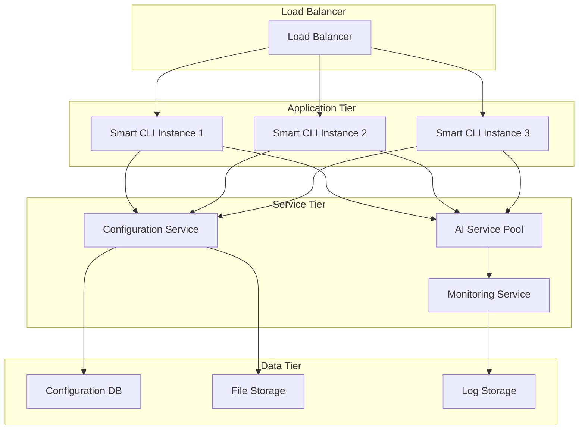

## 🔄 Data Flow Architecture

### Request-Response Cycle

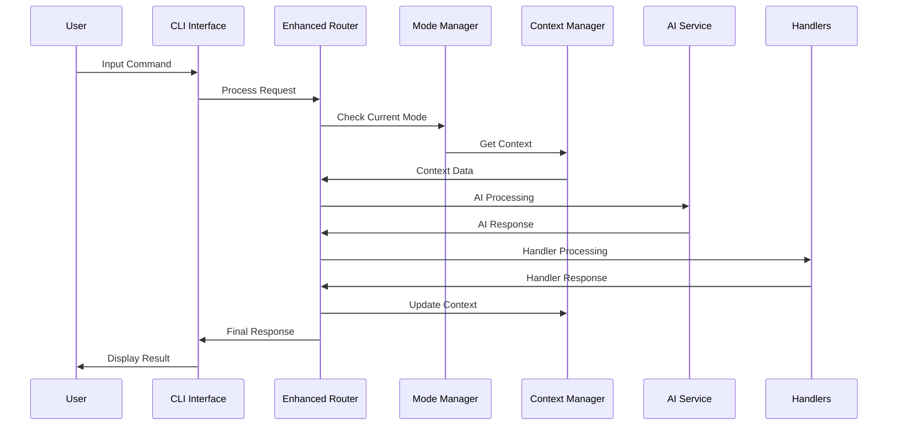

### Context Data Flow

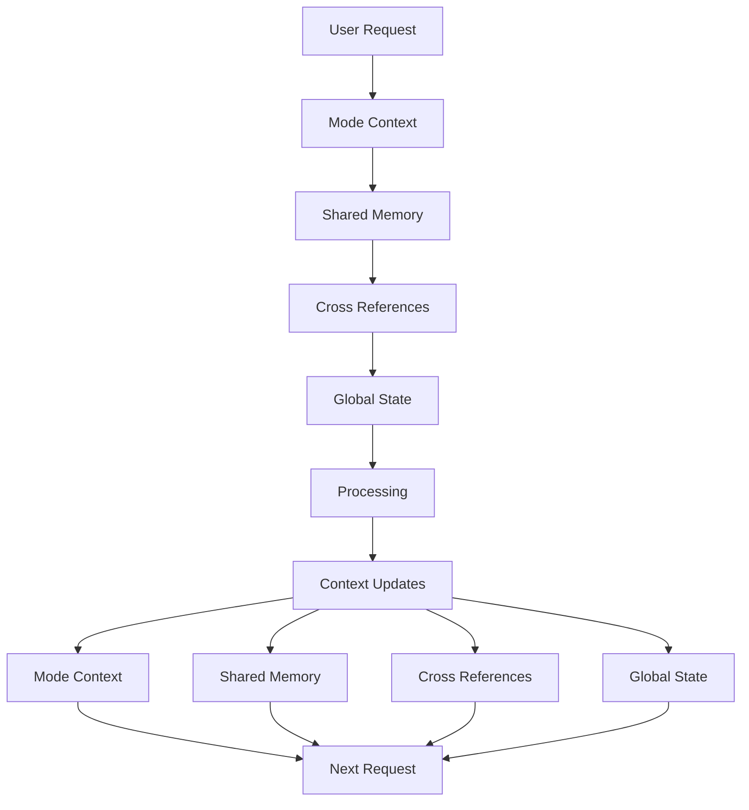

## 📈 Scalability Architecture

### Horizontal Scaling

- **Stateless Design**: Mode contexts persisted externally
- **Load Distribution**: Multiple CLI instances
- **Service Separation**: AI services, configuration, monitoring
- **Cache Layers**: Context caching, response caching

### Performance Optimization

- **Lazy Loading**: Mode components loaded on demand
- **Context Optimization**: Automatic memory management
- **Request Batching**: Efficient AI service usage
- **Intelligent Caching**: Smart cache invalidation

## 🔮 Future Architecture Considerations

### Planned Enhancements

1. **Distributed Mode System**: Multi-machine mode coordination
2. **Advanced AI Integration**: Custom model training
3. **Plugin Architecture**: Third-party mode extensions
4. **Cloud Integration**: Cloud-based context synchronization
5. **Real-time Collaboration**: Multi-user mode sharing

### Architecture Evolution

The Smart CLI architecture is designed for continuous evolution:

- **Modular Design**: Easy component replacement
- **Interface Stability**: Backwards compatibility
- **Extension Points**: Plugin and integration hooks
- **Configuration Flexibility**: Runtime reconfiguration
- **Performance Monitoring**: Continuous optimization

---

This architecture provides a robust, scalable, and maintainable foundation for the Smart CLI Enhanced Mode System, supporting both current functionality and future growth.