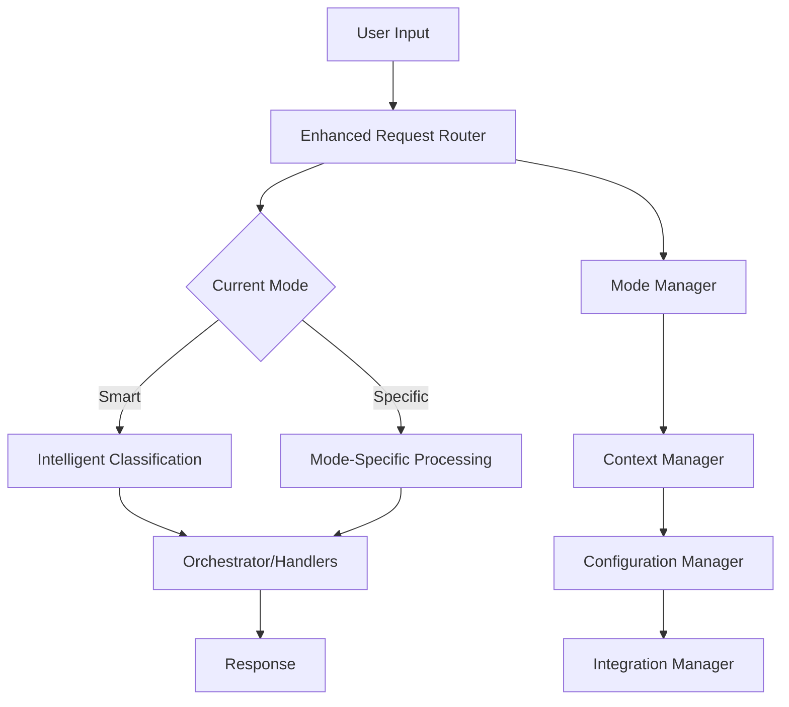

# Smart CLI Enhanced Mode System

## Overview

The Smart CLI Enhanced Mode System represents a revolutionary approach to AI-assisted development, providing specialized operational modes that adapt to different development contexts and workflows. This system combines intelligent auto-detection with explicit mode control, offering unprecedented flexibility and power.

## 🎭 Architecture

### Core Components



### System Integration

The Enhanced Mode System integrates seamlessly with existing Smart CLI architecture through:

- **Backwards Compatibility**: Full compatibility with existing functionality
- **Graceful Fallback**: Automatic fallback to original system if enhanced modes unavailable
- **Zero Breaking Changes**: No disruption to current workflows
- **Progressive Enhancement**: Optional activation with intelligent defaults

## 🎯 Operational Modes

### 1. Smart Mode (Default)
- **Purpose**: Intelligent auto-detection and adaptive processing
- **Behavior**: Analyzes input context and automatically routes to optimal processing
- **Use Cases**: General development tasks, mixed workflows, learning new projects
- **Indicator**: 🤖

```bash
smart > analyze this codebase
🔍 Analysis request detected (confidence: 0.85)
💡 Suggestion: '/mode analysis' might be better for this task
```

### 2. Code Mode
- **Purpose**: Development-focused environment with orchestrator integration
- **Behavior**: Optimized for code creation, modification, and implementation
- **Use Cases**: Feature development, bug fixes, refactoring, testing
- **Indicator**: 💻
- **Special Features**: 
  - Automatic orchestrator engagement
  - Pre/post processing hooks
  - Syntax validation
  - Test integration

```bash
smart > /mode code
💻 Code Development Mode → Orchestrator
📋 Task analysis in progress...
```

### 3. Analysis Mode
- **Purpose**: Deep code analysis and review with security focus
- **Behavior**: Read-only analysis with comprehensive examination capabilities
- **Use Cases**: Code review, security audit, debugging, quality assessment
- **Indicator**: 🔍
- **Permissions**: Read-only (no file modifications)

```bash
smart > /mode analysis
🔍 Analysis Mode Activated - read-only deep analysis
🛡️ Security analysis included
```

### 4. Architect Mode
- **Purpose**: High-level system design and architecture planning
- **Behavior**: Strategic thinking, system-wide analysis, documentation focus
- **Use Cases**: System design, architecture decisions, technical planning
- **Indicator**: 🏗️
- **Special Features**: 
  - Extended context window (20K tokens)
  - Cross-mode context sharing
  - Documentation generation

```bash
smart > /mode architect  
🏗️ Architecture Mode - system design focus
🎨 System architecture analysis...
```

### 5. Learning Mode
- **Purpose**: Educational explanations and interactive learning
- **Behavior**: Step-by-step explanations, examples, tutorials
- **Use Cases**: Learning new technologies, understanding concepts, training
- **Indicator**: 📚
- **Permissions**: Read-only with enhanced explanation capabilities

```bash
smart > /mode learning
📚 Learning Mode - educational explanations
🎓 Step-by-step explanation:
```

### 6. Fast Mode
- **Purpose**: Quick operations and utility commands
- **Behavior**: Minimal overhead, rapid execution, auto-approval for safe operations
- **Use Cases**: Git operations, file management, quick queries
- **Indicator**: ⚡
- **Features**: 30-second timeout, minimal output, auto-approval

```bash
smart > /mode fast
⚡ Fast Mode - rapid operations
🚀 Express execution...
```

### 7. Orchestrator Mode
- **Purpose**: Complex multi-agent workflows and coordination
- **Behavior**: Advanced task decomposition, parallel agent execution
- **Use Cases**: Large features, complex refactoring, multi-component development
- **Indicator**: 🎭
- **Features**: 
  - Up to 5 concurrent agents
  - Advanced resource management
  - Comprehensive coordination

```bash
smart > /mode orchestrator
🎭 Multi-Agent Orchestrator Mode
📋 Multi-agent plan creation in progress...
```

## 🎚️ Mode Management Commands

### Basic Commands

```bash
# View available modes
/mode

# Switch to specific mode
/mode code
/mode analysis [reason]

# Quick switch to previous mode
/switch

# View current mode status
/modestatus

# Context management
/context status
/context clear [mode]
/context optimize
```

### Advanced Usage

```bash
# Mode with reasoning
/mode architect "need to design new microservice architecture"

# Context operations
/context share code architect project_structure
/context clear analysis

# Performance reports
/modestatus performance
```

## 🧠 Context Management

### Context Isolation

Each mode maintains its own isolated context while allowing controlled sharing:

- **Mode-Specific Context**: Private data for each mode
- **Shared Memory**: Cross-mode accessible data
- **Cross-References**: Links between mode contexts
- **Global State**: System-wide information

### Context Sharing Rules

```yaml
# Example context sharing rules
code_to_architect:
  allowed_keys: ["project_structure", "design_patterns", "requirements"]
  transform_keys: 
    implementation_details: "high_level_overview"

architect_to_all:
  allowed_keys: ["system_design", "architecture_decisions", "tech_stack"]
  auto_share: true
```

### Context Lifecycle

1. **Mode Activation**: Fresh context initialized
2. **Request Processing**: Context updated with new information
3. **Mode Switching**: Selective context sharing based on rules
4. **Cleanup**: Automatic optimization and memory management

## ⚙️ Configuration System

### Global Configuration

Location: `~/.smart_cli_modes.yaml`

```yaml
modes:
  code:
    preferred_model: "anthropic/claude-3-sonnet-20240229"
    context_size: 8000
    cost_limits:
      per_session: 15.0
      per_task: 3.0
```

### Project Configuration

Location: `.smartcli` in project root

```yaml
project_name: "My Enterprise App"
project_type: "web"
default_mode: "smart"
tech_stack: ["react", "nodejs", "postgresql"]

modes:
  code:
    pre_processing_hooks: ["check_git_status", "validate_syntax"]
    post_processing_hooks: ["run_tests", "update_docs"]
    custom_prompts:
      welcome: "💻 Development mode for My Enterprise App"
```

### Mode-Specific Settings

- **Model Selection**: Preferred AI models per mode
- **Context Size**: Token limits and memory allocation
- **Tool Access**: Allowed and restricted operations
- **Cost Limits**: Budget controls per mode/session
- **Hooks**: Pre/post processing automation
- **Permissions**: Read/write/execute permissions

## 🔄 Integration Hooks

### Pre-Processing Hooks

Execute before mode processes request:
- `check_git_status`: Verify repository state
- `validate_syntax`: Syntax validation for code
- `backup_before_analysis`: Context backup
- `validate_resources`: Resource availability check

### Post-Processing Hooks

Execute after mode completes processing:
- `run_tests`: Automated testing
- `update_docs`: Documentation updates
- `cleanup_temp`: Temporary file cleanup
- `consolidate_results`: Multi-agent result merging

### Custom Hooks

```python
# Example custom hook
async def custom_security_check(mode: str, user_input: str):
    """Custom security validation hook."""
    if "sensitive" in user_input.lower():
        console.print("🛡️ Security review recommended")
```

## 📊 Performance Monitoring

### Metrics Tracked

- **Usage Patterns**: Mode usage frequency and duration
- **Success Rates**: Task completion rates per mode
- **Cost Analysis**: AI token usage and costs per mode
- **Performance**: Response times and efficiency metrics

### Performance Reports

```bash
/modestatus performance
```

Output:
```
📊 Mode Performance Report:
┌─────────────┬─────────┬──────────────┬─────────────┐
│ Mode        │ Usage   │ Success Rate │ Avg Cost    │
├─────────────┼─────────┼──────────────┼─────────────┤
│ code        │ 45      │ 94%          │ $2.30       │
│ analysis    │ 23      │ 98%          │ $1.20       │
│ architect   │ 12      │ 89%          │ $4.50       │
└─────────────┴─────────┴──────────────┴─────────────┘

💡 Recommendations:
• Mode system performing excellently
• Consider using architect mode for system design tasks
```

## 🔒 Security Features

### Access Control

- **Mode Permissions**: Read/write/execute permissions per mode
- **Tool Restrictions**: Blocked operations in specific modes
- **Confirmation Requirements**: User approval for sensitive operations
- **Audit Logging**: Complete operation tracking

### Security Modes

- **Analysis Mode**: Read-only access prevents accidental modifications
- **Learning Mode**: No file system access for safe exploration
- **Restricted Tools**: Dangerous operations require explicit permission

### Data Protection

- **Context Isolation**: Sensitive data contained within mode contexts
- **Secure Sharing**: Controlled data flow between modes
- **Memory Management**: Automatic cleanup of sensitive information
- **Audit Trails**: Complete logging of mode switches and operations

## 🚀 Getting Started

### Quick Setup

1. **Automatic Activation**: Enhanced Mode System activates automatically
2. **Default Mode**: Starts in Smart mode (auto-detection)
3. **Exploration**: Use `/mode` to see available modes
4. **Configuration**: Create `.smartcli` for project-specific settings

### First Steps

```bash
# Start Smart CLI (Enhanced Mode System auto-activates)
smart

# Explore available modes
/mode

# Try analysis mode
/mode analysis

# Analyze current project
analyze this codebase structure

# Switch to code mode for development
/mode code

# Create new feature
create a user authentication system
```

### Project Setup

```bash
# Create project configuration
smart > /setup project web

# This creates .smartcli with web-optimized settings
# Customize as needed for your specific project
```

## 🔧 Advanced Features

### Multi-Agent Coordination

Orchestrator mode enables complex multi-agent workflows:

```bash
smart > /mode orchestrator
smart > build complete user management system with authentication, authorization, and admin panel

# System automatically:
# 1. Breaks down into sub-tasks
# 2. Assigns specialized agents
# 3. Coordinates parallel execution
# 4. Consolidates results
```

### Custom Mode Creation

```yaml
# .smartcli - custom mode definition
modes:
  review:
    name: "Code Review Mode"
    description: "Specialized code review and feedback"
    allowed_tools: ["file_read", "analysis", "security_scan"]
    custom_prompts:
      welcome: "🔍 Code Review Mode - thorough analysis"
    cost_limits:
      per_session: 5.0
```

### Team Collaboration

```yaml
team_settings:
  shared_modes: ["architect", "learning"]
  approval_required: ["orchestrator"]
  notifications:
    mode_switches: false
    task_completions: true
```

## 📈 Best Practices

### Mode Selection Guidelines

- **Smart Mode**: Default for mixed tasks and exploration
- **Code Mode**: Active development and implementation
- **Analysis Mode**: Code review and debugging
- **Architect Mode**: System design and planning
- **Learning Mode**: Understanding new concepts
- **Fast Mode**: Quick operations and commands
- **Orchestrator Mode**: Complex multi-component tasks

### Configuration Recommendations

1. **Set Project Defaults**: Configure `.smartcli` for consistent team experience
2. **Cost Limits**: Set appropriate budget limits per mode
3. **Tool Permissions**: Restrict dangerous operations appropriately
4. **Custom Prompts**: Personalize mode experience
5. **Hooks**: Automate common pre/post operations

### Performance Optimization

- **Context Size**: Balance capability with cost
- **Model Selection**: Choose appropriate models per mode
- **Memory Management**: Regular context optimization
- **Hook Efficiency**: Keep hooks lightweight and fast

## 🔍 Troubleshooting

### Common Issues

**Enhanced Mode System Not Available**
```bash
⚠️ Enhanced mode system not available: ImportError
# Solution: Check dependencies and imports
```

**Mode Switch Failed**
```bash
❌ Unknown mode: xyz
# Solution: Use /mode to see available modes
```

**Context Memory Issues**
```bash
# Solution: Optimize context memory
/context optimize
```

### Debug Mode

```bash
smart --debug
# Provides detailed logging of mode operations
```

## 🔄 Migration Guide

### From Standard Smart CLI

The Enhanced Mode System is fully backwards compatible:

1. **No Changes Required**: Existing workflows continue unchanged
2. **Gradual Adoption**: Use modes when beneficial
3. **Fallback Protection**: Automatic fallback if issues occur
4. **Progressive Enhancement**: Add project configuration over time

### Existing Projects

1. **Add Configuration**: Create `.smartcli` file
2. **Team Training**: Introduce mode concepts gradually
3. **Performance Monitoring**: Track mode usage and benefits
4. **Optimization**: Refine configuration based on usage patterns

## 📚 API Reference

### Mode Manager API

```python
from core.mode_manager import get_mode_manager, SmartMode

mode_manager = get_mode_manager()
await mode_manager.switch_mode("code", "development task")
config = mode_manager.get_current_config()
```

### Context Manager API

```python
from core.context_manager import get_context_manager

context_manager = get_context_manager()
context = context_manager.get_mode_context("code")
context_manager.update_mode_context("code", {"key": "value"})
```

### Configuration API

```python
from core.mode_config_manager import get_mode_config_manager

config_manager = get_mode_config_manager()
mode_config = config_manager.get_mode_config("code")
project_config = config_manager.get_project_config()
```

## 🤝 Contributing

The Enhanced Mode System welcomes contributions:

1. **New Modes**: Propose and implement specialized modes
2. **Hook System**: Contribute pre/post processing hooks
3. **Configuration**: Enhance configuration capabilities
4. **Performance**: Optimize system performance
5. **Documentation**: Improve guides and examples

See [CONTRIBUTING.md](../CONTRIBUTING.md) for detailed guidelines.

## 📄 License

The Enhanced Mode System is part of Smart CLI and follows the same licensing terms.

---

*The Smart CLI Enhanced Mode System - Redefining AI-Assisted Development*